## 1. High-Level Summary (TL;DR)
*   **Impact:** **High** - Completely overhauls the dataset loading, preprocessing, and augmentation pipeline for 3D volumes to support paired image-mask processing.
*   **Key Changes:**
    *   **Dictionary-based Datasets:** Migrated `VolumeDataset` and collate functions to use dictionary structures (`{"image": ..., "mask": ...}`) instead of tuples, enabling synchronized transformations.
    *   **MONAI Augmentations:** Replaced basic transforms with MONAI's dictionary-based transforms (`RandFlipd`, `RandRotate90d`, etc.) to correctly augment both images and masks.
    *   **Preprocessing Tuning:** Adjusted HU windowing range and resampling strategy (from fixed shape to physical spacing) for better anatomical representation.
    *   **CLI Adoption:** Updated Colab notebooks to use the `predict` CLI via `subprocess` instead of direct Python function calls.

## 2. Visual Overview (Code & Logic Map)

```mermaid
graph TD
    subgraph Data Pipeline Refactor
        A["load_metadata_csv()"] -->|Parses| B["SampleRecord"]
        B -->|Adds| C["mask"]
        C --> D["VolumeDataset.__getitem__()"]
        D -->|Returns Dict| E["{'image': vol, 'mask': mask}"]
        E --> F["preprocess_fn(is_label=True/False)"]
        F --> G["build_monai_transforms()"]
        G --> H["pad_collate_fn()"]
        H -->|Batched Dict| I["DataLoader"]
    end
    
    style A fill:#e3f2fd,color:#0d47a1
    style B fill:#e3f2fd,color:#0d47a1
    style D fill:#c8e6c9,color:#1a5e20
    style E fill:#c8e6c9,color:#1a5e20
    style G fill:#fff3e0,color:#e65100
    style H fill:#fff3e0,color:#e65100
```

## 3. Detailed Change Analysis

### 📦 Dataset & DataLoader Refactoring
**What Changed:** The dataset pipeline was completely refactored to support synchronized image and mask transformations using dictionaries.
*   **`SampleRecord`** (Source: `src/predict/dataset.py`): Added an optional `mask` path field.
*   **`VolumeDataset`** (Source: `src/predict/dataset.py`): `__getitem__` now returns a dictionary (e.g., `{"image": tensor, "mask": tensor}`) instead of an `(x, y)` tuple. It also passes the `is_label` flag to `preprocess_fn` to distinguish between raw volumes and masks.
*   **`pad_collate_fn`**: Rewritten to iterate over dictionary keys and pad tensors dynamically.
*   **Pipeline Updates** (Source: `src/predict/pipeline.py`): `load_metadata_csv` now parses the new `mask` column and validates file existence.

### 🧬 Data Augmentation (MONAI)
**What Changed:** Migrated from array-based to dictionary-based MONAI transforms to ensure spatial augmentations are applied identically to both the input volume and its corresponding ground-truth mask. (Source: `src/predict/augment.py`)

| Transform Function | Keys Affected | Prob / Details |
| :--- | :--- | :--- |
| `RandFlipd` | `image`, `mask` | 50% probability, spatial axis 0 |
| `RandRotate90d` | `image`, `mask` | 50% probability |
| `RandZoomd` | `image`, `mask` | 30% prob, 0.9x to 1.1x zoom |
| `RandGaussianNoised` | `image` (only) | 20% probability |

### ⚙️ Preprocessing Configurations
**What Changed:** Significant updates to the default configuration parameters used across the notebooks to optimize for cardiac CT volumes.

| Config Type | Old Value | New Value | Reason |
| :--- | :--- | :--- | :--- |
| **Resampling** | `mode='shape'`, `(128, 128, 128)` | `mode='spacing'`, `(3.0, 0.7, 0.7)` | Preserves physical spacing over forcing arbitrary voxel shapes. |
| **HU Window** | `lower=-200.0, upper=400.0` | `lower=-200.0, upper=800.0` | Widened to capture denser calcifications and contrast. |

### 📓 Notebook Modernizations
**What Changed:**
*   **`00_Common_Task.ipynb`**: Replaced direct API imports (`generate_metadata_csv`, `validate_metadata_csv`) with `subprocess.check_call(['predict', ...])` to execute the CLI directly.
*   **`10_project1_totalseg_groundtruth.ipynb`**: Added a new cell to generate a dedicated `metadata_project1_masks.csv` manifest containing the paths to the TotalSegmentator heart masks.
*   **`11_project1_train_unet_coarse_mask.ipynb`**: 
    *   Switched from custom `HeartDataset` to the centralized `VolumeDataset`.
    *   Replaced random shuffling with `stratified_split`.
    *   Updated the training/validation loops to handle dictionary batches (`batch['image']`, `batch['mask']`).
    *   Added JSON export for dataset splits (`splits_project1.json`).

### 📝 Reporting Module
**What Changed:** Hardcoded the justification text for Project 1 instead of dynamically building it from a payload. (Source: `src/predict/project1_report.py`). It now explicitly documents the updated spacing `(0.7×0.7×3.0 mm)` and HU window `(-200 to 800)`.

## 4. Impact & Risk Assessment
*   **⚠️ Breaking Changes:**
    *   The `pad_collate_fn` and `VolumeDataset` now return dictionaries instead of tuples. Any downstream training scripts expecting `x, y = batch` will break and must be updated to `batch["image"], batch["mask"]` (or `batch["label"]`).
    *   `metadata.csv` files used for segmentation tasks now require a `mask` column if mask loading is desired.
*   **Testing Suggestions:**
    *   **Collate Function:** Verify that `pad_collate_fn` correctly pads varying sized 3D volumes across all dictionary keys without crashing.
    *   **Augmentation Alignment:** Visually inspect a few augmented batches to ensure that the `mask` undergoes the exact same rotations/flips/zooms as the `image`.
    *   **Notebook Execution:** Run `00_Common_Task.ipynb` to ensure the `subprocess` CLI calls execute correctly in the Colab environment.