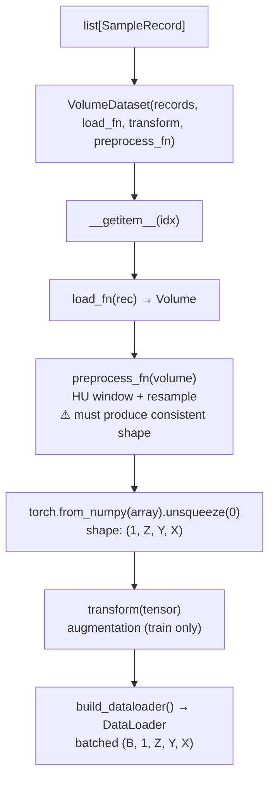

# `VolumeDataset`

**Source:** `src/predict/dataset.py`

A `torch.utils.data.Dataset` subclass that loads 3D medical volumes on demand, applies optional preprocessing and augmentation, and returns `(tensor, label)` pairs for use with PyTorch DataLoaders.

---

## Signature

```python
class VolumeDataset(torch.utils.data.Dataset):
    def __init__(
        self,
        records:       list[SampleRecord],
        load_fn:       Callable[[SampleRecord], Volume] = default_load_volume,
        transform:     Callable[[Any], Any] | None      = None,
        preprocess_fn: Callable[[Volume], Volume] | None = None,
    ) -> None: ...

    def __len__(self) -> int: ...

    def __getitem__(self, idx: int) -> tuple[torch.Tensor, int]: ...
```

---

## Constructor Parameters

| Parameter | Type | Default | Description |
|---|---|---|---|
| `records` | `list[SampleRecord]` | — | Ordered list of subject records; each becomes one dataset item |
| `load_fn` | `Callable[[SampleRecord], Volume]` | `default_load_volume` | Function that loads a `Volume` from a `SampleRecord`; replace to customise I/O |
| `transform` | `Callable \| None` | `None` | Augmentation transform applied to the tensor after loading and preprocessing; typically the output of [`build_monai_transforms()`](../augment/build_monai_transforms.md) |
| `preprocess_fn` | `Callable[[Volume], Volume] \| None` | `None` | Preprocessing function applied to the `Volume` before tensor conversion; typically a lambda composing `apply_hu_window` + `resample_volume` |

---

## Methods

### `__len__()`

```python
def __len__(self) -> int
```

Returns the number of records in the dataset.

### `__getitem__(idx)`

```python
def __getitem__(self, idx: int) -> tuple[torch.Tensor, int]
```

Loads and returns a single `(tensor, label)` pair:

1. Retrieves `rec = self.records[idx]`.
2. Calls `self.load_fn(rec)` to get a `Volume`.
3. If `self.preprocess_fn` is set, applies it: `volume = self.preprocess_fn(volume)`.
4. Converts `volume.array` to a `float32` PyTorch tensor and adds a channel dimension: shape becomes `(1, Z, Y, X)`.
5. If `self.transform` is set, applies it to the tensor.
6. Returns `(tensor, rec.label)`.

**Return shape:** `(1, Z, Y, X)` for the tensor; `int` for the label.

---

## In the Data Pipeline

`VolumeDataset` bridges the preprocessing world (NumPy arrays) and the PyTorch training world (tensors and DataLoaders).



### ASCII equivalent

```
list[SampleRecord]
  └─► VolumeDataset(records, load_fn, transform, preprocess_fn)   ← here
        └─► __getitem__(idx)
              ├─► load_fn(rec)             → Volume
              ├─► preprocess_fn(volume)    → Volume (HU window + resample)
              ├─► tensor = torch.from_numpy(volume.array).unsqueeze(0)
              └─► transform(tensor)        → augmented tensor
                    └─► build_dataloader() → DataLoader
```

---

## Usage Example

```python
from pathlib import Path
from predict.dataset import VolumeDataset, SampleRecord, default_load_volume
from predict.config import HUWindowConfig, ResampleConfig
from predict.preprocess import apply_hu_window, resample_volume
from predict.augment import build_monai_transforms

records = [
    SampleRecord("p001", Path("data/raw/p001"), label=0, kind="dicom_series"),
    SampleRecord("p002", Path("data/raw/p002"), label=1, kind="dicom_series"),
]

hu_cfg = HUWindowConfig()
rs_cfg = ResampleConfig()

def preprocess(volume):
    volume = apply_hu_window(volume, hu_cfg)
    volume = resample_volume(volume, rs_cfg)
    return volume

augment = build_monai_transforms(enable=True)

dataset = VolumeDataset(
    records=records,
    load_fn=default_load_volume,
    transform=augment,
    preprocess_fn=preprocess,
)

print(len(dataset))       # 2
tensor, label = dataset[0]
print(tensor.shape)       # torch.Size([1, 128, 128, 128])
print(label)              # 0
```

---

## Notes

> **Warning:** `VolumeDataset` requires PyTorch (`torch`). If PyTorch is not installed, instantiating the class will raise an `ImportError`.

> **⚠ Shape consistency requirement:** Every tensor returned by `__getitem__()` must have the **same `(Z, Y, X)` shape** for default PyTorch batching to work. If `preprocess_fn` uses `resample_volume(mode="spacing")`, each subject's output shape depends on its original scan dimensions and voxel spacing, producing variable-size tensors. In that case, pass [`pad_collate_fn()`](pad_collate_fn.md) to the DataLoader (which [`build_dataloader()`](build_dataloader.md) does by default) — but the **recommended approach is to use `ResampleConfig(mode="shape", target_shape=(Z, Y, X))`** so all tensors share a fixed shape.
>
> When `export_processed=True` is used in [`run_pipeline()`](../pipeline/run_pipeline.md), the `.npy` files on disk must all have been produced with the same `target_shape`; mixing `.npy` files of different shapes will cause batch assembly to fail (without `pad_collate_fn`) or silently produce unevenly-padded batches (with `pad_collate_fn`).

- Loading is performed **lazily** (at `__getitem__` time), so the dataset can be large without holding all volumes in memory simultaneously.
- When `export_processed=True` is used in [`run_pipeline()`](../pipeline/run_pipeline.md), records point to `.npy` files and `preprocess_fn` is `None` (preprocessing was done offline).
- For variable-size volumes (different shapes per subject), use [`pad_collate_fn()`](pad_collate_fn.md) in the DataLoader to pad batches to a common shape.

---

## Related

- [`SampleRecord`](SampleRecord.md) — each element in `records`
- [`default_load_volume()`](default_load_volume.md) — default `load_fn`
- [`pad_collate_fn()`](pad_collate_fn.md) — collate function for variable-size volumes
- [`build_dataloader()`](build_dataloader.md) — wraps `VolumeDataset` in a `DataLoader`
- [`build_monai_transforms()`](../augment/build_monai_transforms.md) — produces the `transform` argument
- [`apply_hu_window()`](../preprocess/apply_hu_window.md) — used inside `preprocess_fn`
- [`resample_volume()`](../preprocess/resample_volume.md) — used inside `preprocess_fn`
