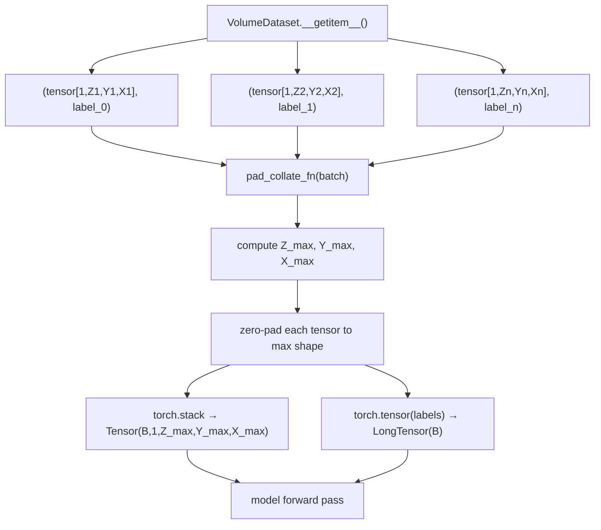

# `pad_collate_fn()`

**Source:** `src/predict/dataset.py`

A custom PyTorch collate function that pads variable-size 3D volumes in a batch to the maximum shape in each spatial dimension, enabling batching of subjects with different image sizes.

---

## Signature

```python
def pad_collate_fn(
    batch: list[tuple[torch.Tensor, int]],
) -> tuple[torch.Tensor, torch.Tensor]
```

---

## Parameters

| Parameter | Type | Description |
|---|---|---|
| `batch` | `list[tuple[torch.Tensor, int]]` | List of `(tensor, label)` pairs returned by `VolumeDataset.__getitem__()`; tensors have shape `(1, Z, Y, X)` (potentially different per item) |

---

## Return Value

A 2-tuple:

| Position | Type | Shape | Description |
|---|---|---|---|
| `[0]` — stacked tensor | `torch.Tensor` | `(B, C, Z_max, Y_max, X_max)` | Batch of zero-padded volumes |
| `[1]` — labels tensor | `torch.Tensor` | `(B,)` | Long tensor of integer class labels |

where `B` is the batch size, `C` is the number of channels (always 1 in PrediCT), and `Z_max`, `Y_max`, `X_max` are the maximum spatial extents across all items in the batch.

---

## Description

The default PyTorch collate function (`torch.utils.data.default_collate`) requires all tensors in a batch to have the same shape. Because resampling with `mode="spacing"` produces volumes of varying shapes (depending on the original scan dimensions), a custom collate function is necessary.

`pad_collate_fn()` works as follows:

1. Determines `Z_max`, `Y_max`, `X_max` across all tensors in the batch.
2. Creates a zero-filled output tensor of shape `(B, C, Z_max, Y_max, X_max)`.
3. For each tensor in the batch, copies it into the output tensor starting at offset `(0, 0, 0, 0, 0)` (top-left-front corner). Volumes smaller than the maximum are zero-padded on the right/bottom/back.
4. Stacks labels into a `torch.LongTensor` of shape `(B,)`.

---

## In the Data Pipeline

`pad_collate_fn` is passed as the `collate_fn` argument to `torch.utils.data.DataLoader` inside [`build_dataloader()`](build_dataloader.md).



> **Prefer uniform shapes:** Zero-padding is a fallback. Use `ResampleConfig(mode='shape', target_shape=(Z, Y, X))` so every volume has the **same shape**, eliminating padding overhead and ensuring consistent batch memory usage. See [Training Tensor Shape Requirement](../index.md#training-tensor-shape-requirement).

### ASCII equivalent

```
VolumeDataset.__getitem__()
  └─► (tensor[1,Z,Y,X], label)  ← variable shapes
        └─► pad_collate_fn(batch)   ← here
              └─► (Tensor[B,1,Z_max,Y_max,X_max], LongTensor[B])
                    └─► model forward pass
```

---

## Usage Example

```python
import torch
from predict.dataset import pad_collate_fn

# Simulate a batch of two tensors with different sizes
t1 = torch.zeros(1, 64, 100, 100)
t2 = torch.zeros(1, 80, 90, 110)

batch = [(t1, 0), (t2, 1)]
tensors, labels = pad_collate_fn(batch)

print(tensors.shape)  # torch.Size([2, 1, 80, 110, 110])
#                                     B  C  Zmax Ymax Xmax
print(labels)         # tensor([0, 1])
```

### Using with DataLoader

```python
from torch.utils.data import DataLoader
from predict.dataset import VolumeDataset, pad_collate_fn

dataset = VolumeDataset(records=records, ...)
loader = DataLoader(dataset, batch_size=4, collate_fn=pad_collate_fn)

for tensors, labels in loader:
    print(tensors.shape)  # (4, 1, Z_max, Y_max, X_max)
```

---

## Notes

> **Warning:** Padding increases the effective batch size in memory. If subjects have very different sizes, the padded batch can be significantly larger than any individual volume. Consider using `mode="shape"` resampling to produce fixed-size volumes and avoid padding altogether.

- Zero-padding is used (fill value `0.0`). For HU-windowed data in `[0, 1]`, this corresponds to the minimum intensity, which is anatomically safe for most models.
- Padding is applied to the **end** (right/bottom/back) of each spatial dimension, not centred. Some models (e.g., those using global pooling) are insensitive to padding location; others may not be.

---

## Related

- [`build_dataloader()`](build_dataloader.md) — passes `pad_collate_fn` to `DataLoader`
- [`VolumeDataset`](VolumeDataset.md) — the dataset that produces the variable-size tensors
- [`resample_volume()`](../preprocess/resample_volume.md) — using `mode="shape"` avoids the need for padding
