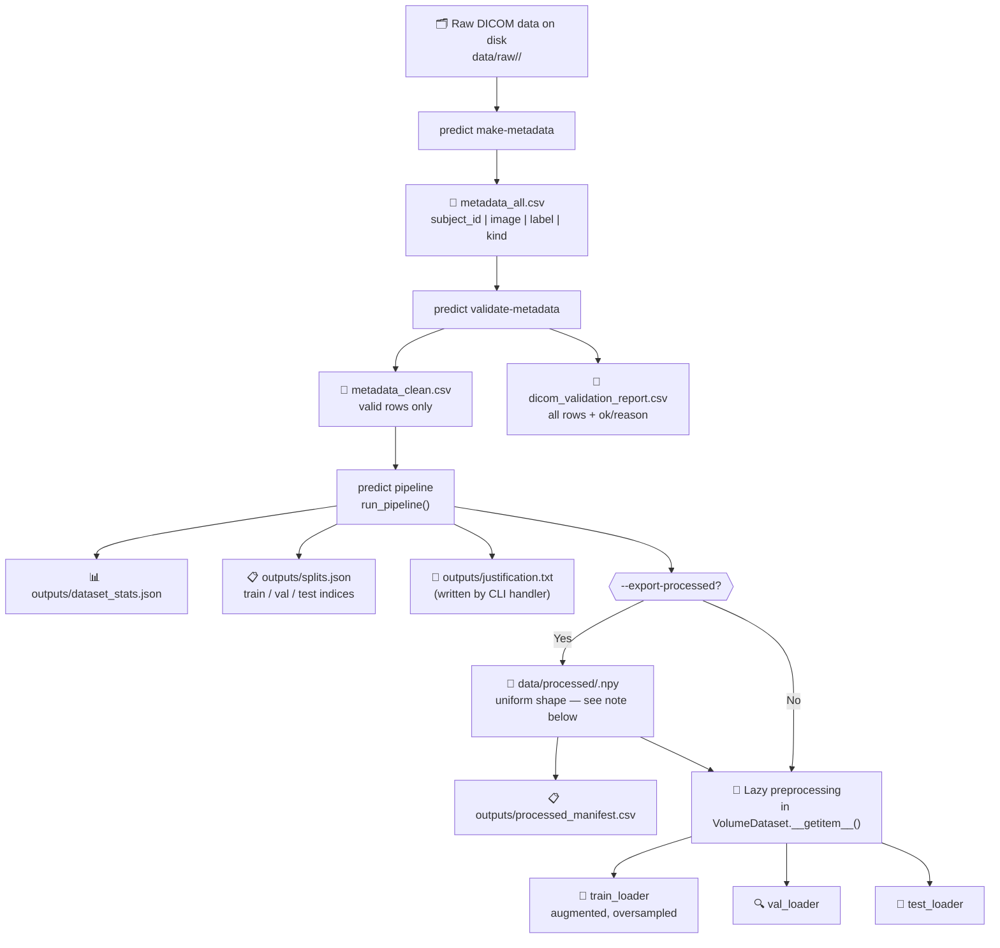

# PrediCT CLI — Documentation Index

**PrediCT** is a command-line toolkit for end-to-end preprocessing of 3D medical imaging datasets (primarily cardiac DICOM), producing validated, resampled, HU-windowed volumes and PyTorch-ready DataLoaders for downstream deep-learning tasks.

---

## Table of Contents

1. [What PrediCT CLI Does](#what-predict-cli-does)
2. [Overall Data Pipeline](#overall-data-pipeline)
3. [Training Tensor Shape Requirement](#training-tensor-shape-requirement)
4. [Quick-Start Usage](#quick-start-usage)
5. [Module Overview](#module-overview)
6. [How Outputs Feed Into Each Stage](#how-outputs-feed-into-each-stage)
7. [All Documentation Links](#all-documentation-links)

---

## What PrediCT CLI Does

PrediCT automates the journey from raw DICOM folders on disk to batched, augmented PyTorch tensors ready for model training. It handles:

- **Metadata generation** — scans subject directories and emits a CSV inventory.
- **Metadata validation** — reads each DICOM series and marks it as valid/invalid, writing a cleaned CSV and a full audit report.
- **End-to-end pipeline** — loads the cleaned metadata, splits subjects into train/val/test, optionally oversamples the minority class, preprocesses volumes (HU windowing + resampling), optionally exports `.npy` files, wraps everything in PyTorch DataLoaders, and writes JSON/CSV/TXT artifacts for reproducibility.

---

## Overall Data Pipeline



> **Shape consistency note:** Whether you use `--export-processed` or lazy preprocessing, **every volume reaching the DataLoader must have the same spatial shape**. Use `ResampleConfig(mode="shape", target_shape=(Z, Y, X))` to guarantee this. See the [training tensor shape requirement](#training-tensor-shape-requirement) section below.

### ASCII equivalent

```
Raw DICOM data
    ↓ predict make-metadata
metadata_all.csv
    ↓ predict validate-metadata
metadata_clean.csv + dicom_validation_report.csv
    ↓ predict pipeline (run_pipeline)
    ├── outputs/dataset_stats.json
    ├── outputs/splits.json
    ├── outputs/justification.txt (CLI only)
    ├── [--export-processed] data/processed/<subject>.npy  ← uniform shape required
    └── PyTorch DataLoaders (train / val / test)
```

### Stage descriptions

| Stage | CLI command | Input | Key outputs |
|---|---|---|---|
| Metadata generation | `make-metadata` | `data/raw/` | `metadata_all.csv` |
| Metadata validation | `validate-metadata` | `metadata_all.csv` | `metadata_clean.csv`, `dicom_validation_report.csv` |
| Pipeline | `pipeline` | `metadata_clean.csv` | `dataset_stats.json`, `splits.json`, `justification.txt`, DataLoaders |

---

## Training Tensor Shape Requirement

> **⚠ Critical:** PyTorch's `DataLoader` requires all tensors in a batch to have the **same shape** when using the default collate function. PrediCT includes [`pad_collate_fn()`](dataset/pad_collate_fn.md) to handle variable-size batches via zero-padding, but **the recommended approach is to produce uniformly-shaped volumes up-front**.

### Why shape consistency matters

- `VolumeDataset.__getitem__()` produces tensors of shape `(1, Z, Y, X)`.
- When using `--export-processed`, each subject's `.npy` file must have **the same `(Z, Y, X)` shape**.
- If shapes differ across subjects, `pad_collate_fn` pads every batch to the largest volume seen in that batch — this wastes GPU memory and can introduce training artefacts if padding is large.

### How to guarantee shape consistency

Use `ResampleConfig(mode="shape", target_shape=(Z, Y, X))` — this forces every volume to exactly the same output shape regardless of its original dimensions or voxel spacing:

```bash
predict pipeline \
  --resample-spacing 1.0 1.0 1.0 \
  --export-processed
```

> **Note:** `--resample-spacing` uses `mode="spacing"` which produces **variable shapes** depending on each scan's original dimensions. For a **fixed shape**, configure `ResampleConfig(mode="shape")` programmatically or add explicit shape normalization after resampling.

### Choosing a target shape

| Consideration | Recommendation |
|---|---|
| GPU memory per batch | Lower values (e.g. 64³, 96³) reduce memory |
| Clinical detail retention | Higher values preserve fine structures |
| Typical cardiac CT | 128³ or 96³ at 1 mm isotropic is common |
| Very anisotropic datasets | Consider 128×128×64 (Z smaller for thick-slice CT) |

See [`ResampleConfig`](config/ResampleConfig.md) and [`resample_volume()`](preprocess/resample_volume.md) for full configuration options.

---

## Quick-Start Usage

### 1. Generate metadata

```bash
predict make-metadata \
  --raw-dir data/raw \
  --out-csv data/metadata_all.csv \
  --kind dicom_series \
  --default-label 0
```

### 2. Validate metadata

```bash
predict validate-metadata \
  --metadata-csv data/metadata_all.csv \
  --raw-dir data/raw \
  --out-clean-csv data/metadata_clean.csv \
  --out-report-csv outputs/dicom_validation_report.csv \
  --mode shallow
```

### 3. Run the full pipeline

```bash
predict pipeline \
  --project-root . \
  --metadata-csv outputs/metadata_clean.csv \
  --hu-bounds -200 400 \
  --resample-spacing 1.0 1.0 1.0 \
  --export-processed
```

#### Common `pipeline` flags

| Flag | Default | Description |
|---|---|---|
| `--project-root` | `cwd` | Root of the project |
| `--metadata-csv` | auto-discovered | Path to cleaned metadata CSV |
| `--stats-path` | `outputs/dataset_stats.json` | Where to write stats |
| `--split-manifest` | `outputs/splits.json` | Train/val/test index file |
| `--processed-manifest` | `outputs/processed_manifest.csv` | Manifest of exported `.npy` files |
| `--processed-dir` | `data/processed` | Where `.npy` files are saved |
| `--raw-dir` | env / default | Override raw DICOM directory |
| `--resample-spacing` | `1.0 1.0 1.0` | Target voxel spacing (Z Y X) |
| `--hu-bounds` | `-200 400` | HU clip window (lower upper) |
| `--dry-run` | off | Skip DataLoader construction |
| `--no-augment` | off | Disable training augmentation |
| `--no-oversample-train` | off | Disable minority oversampling |
| `--export-processed` | off | Write `.npy` volumes to disk |

---

## Module Overview

| Module | Source file | Purpose | Key public items |
|---|---|---|---|
| `cli` | `src/predict/cli.py` | CLI entry point and argument parsing | [`build_parser()`](cli/build_parser.md), [`main()`](cli/main.md) |
| `config` | `src/predict/config.py` | Configuration dataclasses and path resolution | [`resolve_raw_dir()`](config/resolve_raw_dir.md), [`PathsConfig`](config/PathsConfig.md), [`ResampleConfig`](config/ResampleConfig.md), [`HUWindowConfig`](config/HUWindowConfig.md), [`SplitConfig`](config/SplitConfig.md), [`LoaderConfig`](config/LoaderConfig.md) |
| `metadata` | `src/predict/metadata.py` | Scan raw dirs and emit metadata CSV | [`generate_metadata_csv()`](metadata/generate_metadata_csv.md) |
| `validate` | `src/predict/validate.py` | Validate DICOM readability per series | [`validate_dicom_series_dir()`](validate/validate_dicom_series_dir.md), [`validate_metadata_csv()`](validate/validate_metadata_csv.md) |
| `pipeline` | `src/predict/pipeline.py` | Orchestrate the full preprocessing pipeline | [`run_pipeline()`](pipeline/run_pipeline.md), [`load_metadata_csv()`](pipeline/load_metadata_csv.md), [`build_records_fallback()`](pipeline/build_records_fallback.md), [`PipelineOutputs`](pipeline/PipelineOutputs.md) |
| `preprocess` | `src/predict/preprocess.py` | HU windowing and volume resampling | [`hu_windowing()`](preprocess/hu_windowing.md), [`apply_hu_window()`](preprocess/apply_hu_window.md), [`resample_volume()`](preprocess/resample_volume.md) |
| `io` | `src/predict/io.py` | Read/write DICOM, NIfTI, and NumPy volumes | [`Volume`](io/Volume.md), [`discover_subject_dirs()`](io/discover_subject_dirs.md), [`read_dicom_series()`](io/read_dicom_series.md), [`save_numpy_volume()`](io/save_numpy_volume.md), [`load_numpy_volume()`](io/load_numpy_volume.md), [`load_nifti_volume()`](io/load_nifti_volume.md) |
| `dataset` | `src/predict/dataset.py` | PyTorch Dataset and DataLoader utilities | [`SampleRecord`](dataset/SampleRecord.md), [`VolumeDataset`](dataset/VolumeDataset.md), [`default_load_volume()`](dataset/default_load_volume.md), [`pad_collate_fn()`](dataset/pad_collate_fn.md), [`build_dataloader()`](dataset/build_dataloader.md) |
| `split` | `src/predict/split.py` | Stratified train/val/test splitting | [`SplitResult`](split/SplitResult.md), [`stratified_split()`](split/stratified_split.md) |
| `sampling` | `src/predict/sampling.py` | Minority-class oversampling | [`oversample_minority()`](sampling/oversample_minority.md) |
| `augment` | `src/predict/augment.py` | MONAI 3D augmentation transforms | [`build_monai_transforms()`](augment/build_monai_transforms.md) |
| `report` | `src/predict/report.py` | Human-readable preprocessing justification | [`build_justification_text()`](report/build_justification_text.md), [`write_justification_report()`](report/write_justification_report.md) |

---

## How Outputs Feed Into Each Stage

```
generate_metadata_csv()
    └─► metadata_all.csv
            │
        validate_metadata_csv()
            └─► metadata_clean.csv  ──────────────────────────────┐
            └─► dicom_validation_report.csv                        │
                                                                   ▼
                                                        load_metadata_csv()
                                                         or build_records_fallback()
                                                               │
                                                          [SampleRecord list]
                                                               │
                                                        stratified_split()
                                                               │
                                                        oversample_minority()  (train only)
                                                               │
                                                   ┌───────────┴───────────────┐
                                               (export_processed=True)     (in-memory)
                                                   │                           │
                                          read_dicom_series()         read_dicom_series()
                                          apply_hu_window()            apply_hu_window()
                                          resample_volume()            resample_volume()
                                          save_numpy_volume()               │
                                               │                      VolumeDataset
                                               ▼                      build_dataloader()
                                        processed_manifest.csv              │
                                               │                      PipelineOutputs
                                               └──────────────────────────► │
                                                                             ▼
                                                                   dataset_stats.json
                                                                   splits.json
                                                                   justification.txt
```

---

## All Documentation Links

### CLI
- [build_parser()](cli/build_parser.md)
- [main()](cli/main.md)

### Config
- [resolve_raw_dir()](config/resolve_raw_dir.md)
- [PathsConfig](config/PathsConfig.md)
- [ResampleConfig](config/ResampleConfig.md)
- [HUWindowConfig](config/HUWindowConfig.md)
- [SplitConfig](config/SplitConfig.md)
- [LoaderConfig](config/LoaderConfig.md)

### Metadata
- [generate_metadata_csv()](metadata/generate_metadata_csv.md)

### Validate
- [validate_dicom_series_dir()](validate/validate_dicom_series_dir.md)
- [validate_metadata_csv()](validate/validate_metadata_csv.md)

### Pipeline
- [PipelineOutputs](pipeline/PipelineOutputs.md)
- [load_metadata_csv()](pipeline/load_metadata_csv.md)
- [build_records_fallback()](pipeline/build_records_fallback.md)
- [run_pipeline()](pipeline/run_pipeline.md)

### Preprocess
- [hu_windowing()](preprocess/hu_windowing.md)
- [apply_hu_window()](preprocess/apply_hu_window.md)
- [resample_volume()](preprocess/resample_volume.md)

### IO
- [Volume](io/Volume.md)
- [discover_subject_dirs()](io/discover_subject_dirs.md)
- [read_dicom_series()](io/read_dicom_series.md)
- [save_numpy_volume()](io/save_numpy_volume.md)
- [load_numpy_volume()](io/load_numpy_volume.md)
- [load_nifti_volume()](io/load_nifti_volume.md)

### Dataset
- [SampleRecord](dataset/SampleRecord.md)
- [default_load_volume()](dataset/default_load_volume.md)
- [VolumeDataset](dataset/VolumeDataset.md)
- [pad_collate_fn()](dataset/pad_collate_fn.md)
- [build_dataloader()](dataset/build_dataloader.md)

### Split
- [SplitResult](split/SplitResult.md)
- [stratified_split()](split/stratified_split.md)

### Sampling
- [oversample_minority()](sampling/oversample_minority.md)

### Augment
- [build_monai_transforms()](augment/build_monai_transforms.md)

### Report
- [build_justification_text()](report/build_justification_text.md)
- [write_justification_report()](report/write_justification_report.md)
