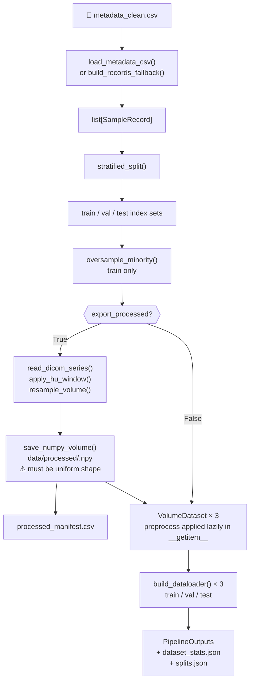

# `run_pipeline()`

**Source:** `src/predict/pipeline.py`

The central orchestration function of PrediCT. Executes every stage of the preprocessing pipeline — from loading subject records through splitting, oversampling, preprocessing, and DataLoader construction — and returns a [`PipelineOutputs`](PipelineOutputs.md) object containing the DataLoaders and all written artifacts.

---

## Signature

```python
def run_pipeline(
    project_root:              Path,
    metadata_csv:              Path | None           = None,
    stats_path:                Path | None           = None,
    split_manifest_path:       Path | None           = None,
    processed_manifest_path:   Path | None           = None,
    processed_dir:             Path | None           = None,
    raw_dir:                   Path | None           = None,
    resample_cfg:              ResampleConfig | None = None,
    hu_cfg:                    HUWindowConfig | None = None,
    split_cfg:                 SplitConfig | None    = None,
    loader_cfg:                LoaderConfig | None   = None,
    enable_augmentation:       bool = True,
    oversample_train:          bool = True,
    export_processed:          bool = False,
    dry_run:                   bool = False,
) -> PipelineOutputs
```

---

## Parameters

| Parameter | Type | Default | Description |
|---|---|---|---|
| `project_root` | `Path` | — | **Required.** Absolute path to the project root; all relative paths are anchored here |
| `metadata_csv` | `Path \| None` | `None` | Path to the validated metadata CSV; if `None`, auto-discovery is attempted, then [`build_records_fallback()`](build_records_fallback.md) is used |
| `stats_path` | `Path \| None` | `None` | Output path for `dataset_stats.json`; defaults to `outputs/dataset_stats.json` |
| `split_manifest_path` | `Path \| None` | `None` | Output path for `splits.json`; defaults to `outputs/splits.json` |
| `processed_manifest_path` | `Path \| None` | `None` | Output path for `processed_manifest.csv`; defaults to `outputs/processed_manifest.csv` |
| `processed_dir` | `Path \| None` | `None` | Directory for `.npy` exports; defaults to `data/processed` |
| `raw_dir` | `Path \| None` | `None` | Override for the raw DICOM directory; passed to [`resolve_raw_dir()`](../config/resolve_raw_dir.md) |
| `resample_cfg` | `ResampleConfig \| None` | `None` | Resampling configuration; defaults to `ResampleConfig()` (1 mm isotropic spacing) |
| `hu_cfg` | `HUWindowConfig \| None` | `None` | HU windowing configuration; defaults to `HUWindowConfig()` (window `[-200, 400]`) |
| `split_cfg` | `SplitConfig \| None` | `None` | Split configuration; defaults to `SplitConfig()` (64/16/20 train/val/test split with seed 42) |
| `loader_cfg` | `LoaderConfig \| None` | `None` | DataLoader configuration; defaults to `LoaderConfig()` (batch size 2, single process) |
| `enable_augmentation` | `bool` | `True` | If `True`, applies MONAI augmentation transforms to the training set |
| `oversample_train` | `bool` | `True` | If `True`, applies minority-class oversampling to the training set records |
| `export_processed` | `bool` | `False` | If `True`, preprocesses and saves all volumes as `.npy` files; DataLoaders load from `.npy` instead of DICOM |
| `dry_run` | `bool` | `False` | If `True`, performs all steps up to DataLoader construction but returns `None` loaders |

---

## Return Value

| Type | Description |
|---|---|
| [`PipelineOutputs`](PipelineOutputs.md) | DataLoaders, statistics dict, and paths to written artifacts |

---

## Pipeline Stages

The function executes the following stages in order:

### Stage 1 — Resolve configuration

All `None` config arguments are replaced with their defaults. [`PathsConfig`](../config/PathsConfig.md) is constructed from `project_root` and `raw_dir`.

### Stage 2 — Load records

If `metadata_csv` is provided (or can be auto-discovered), [`load_metadata_csv()`](load_metadata_csv.md) is called. Otherwise, [`build_records_fallback()`](build_records_fallback.md) is used. Any loading warnings are collected.

### Stage 3 — Stratified split

[`stratified_split()`](../split/stratified_split.md) divides the records into train, validation, and test index sets according to `split_cfg`. The split indices are written to `splits.json`.

### Stage 4 — Oversample training set (optional)

If `oversample_train=True`, [`oversample_minority()`](../sampling/oversample_minority.md) is applied to the **training records only**, duplicating minority-class samples to equalise class counts.

### Stage 5 — Preprocess and export (optional)

If `export_processed=True`:
- For each subject in all splits, reads the volume with [`read_dicom_series()`](../io/read_dicom_series.md) (or the appropriate loader).
- Applies [`apply_hu_window()`](../preprocess/apply_hu_window.md) then [`resample_volume()`](../preprocess/resample_volume.md).
- Saves the result with [`save_numpy_volume()`](../io/save_numpy_volume.md) to `processed_dir/<subject_id>.npy`.
- Writes `processed_manifest.csv` mapping each subject to its `.npy` path.
- Updates `SampleRecord.image` and `SampleRecord.kind` to point to the `.npy` file.

If `export_processed=False`, preprocessing is deferred and applied **lazily** inside each `VolumeDataset.__getitem__()` call.

### Stage 6 — Build datasets

Creates three [`VolumeDataset`](../dataset/VolumeDataset.md) instances (train, val, test), each with:
- `load_fn = default_load_volume`
- `preprocess_fn` applying HU window + resampling (when `export_processed=False`)
- `transform` = MONAI augmentation transforms (training only, when `enable_augmentation=True`)

### Stage 7 — Build DataLoaders

Wraps each dataset with [`build_dataloader()`](../dataset/build_dataloader.md). The training loader uses `shuffle=True`; validation and test loaders use `shuffle=False`.

### Stage 8 — Write statistics

Collects all stats into a dict and writes `dataset_stats.json`. Note that the justification report (`justification.txt`) is written by the CLI handler `_cmd_pipeline()` after `run_pipeline()` returns, not by `run_pipeline()` itself.

---

## Written Artifacts

| File | Written when | Description |
|---|---|---|
| `outputs/dataset_stats.json` | Always | Full statistics dict |
| `outputs/splits.json` | Always | Train/val/test index lists |
| `outputs/justification.txt` | When called via CLI | Written by `_cmd_pipeline()` after `run_pipeline()` returns; not written by `run_pipeline()` directly |
| `outputs/processed_manifest.csv` | `export_processed=True` | Mapping of subject → `.npy` path |
| `data/processed/<subject>.npy` | `export_processed=True` | Preprocessed volume arrays |

---

## In the Data Pipeline



### ASCII equivalent

```
load_metadata_csv() or build_records_fallback()
  └─► stratified_split()
        └─► oversample_minority()  (train only)
              └─► [optional] read_dicom_series() → apply_hu_window() → resample_volume() → save_numpy_volume()
                    └─► VolumeDataset × 3
                          └─► build_dataloader() × 3
                                └─► PipelineOutputs
```

---

## Usage Example

### Minimal usage

```python
from pathlib import Path
from predict.pipeline import run_pipeline

outputs = run_pipeline(project_root=Path("/home/user/cardiac"))
```

### Full configuration

```python
from pathlib import Path
from predict.pipeline import run_pipeline
from predict.config import (
    ResampleConfig, HUWindowConfig, SplitConfig, LoaderConfig
)

outputs = run_pipeline(
    project_root=Path("/home/user/cardiac"),
    metadata_csv=Path("outputs/metadata_clean.csv"),
    resample_cfg=ResampleConfig(mode="spacing", target_spacing=(1.0, 1.0, 1.0)),
    hu_cfg=HUWindowConfig(lower=-200.0, upper=400.0),
    split_cfg=SplitConfig(test_size=0.2, val_size=0.2, random_state=42),
    loader_cfg=LoaderConfig(batch_size=4, num_workers=2, pin_memory=True),
    enable_augmentation=True,
    oversample_train=True,
    export_processed=True,
)

print(f"Subjects: {outputs.stats['num_subjects']}")
print(f"Splits:   {outputs.stats['split_sizes']}")

for batch, labels in outputs.train_loader:
    print(batch.shape)  # (B, 1, Z, Y, X)
    break
```

### Dry run (validate config only)

```python
outputs = run_pipeline(
    project_root=Path("/home/user/cardiac"),
    dry_run=True,
)
# outputs.train_loader is None
print(outputs.stats)
```

### From the CLI

```bash
predict pipeline \
  --project-root /home/user/cardiac \
  --metadata-csv outputs/metadata_clean.csv \
  --hu-bounds -200 400 \
  --resample-spacing 1.0 1.0 1.0 \
  --export-processed \
  --justification-path outputs/justification.txt
```

---

## Notes

> **Warning:** When `export_processed=False`, preprocessing is applied at DataLoader iteration time. This increases CPU load during training but avoids the upfront disk I/O and storage cost.

> **Warning:** `export_processed=True` can consume significant disk space (each volume is saved as a `float32` NumPy array). A 128³ volume at float32 requires ~8 MB per subject.

> **⚠ Shape consistency for training tensors:** All `.npy` files written by `export_processed=True` and all volumes produced by lazy preprocessing **must have identical spatial shapes** `(Z, Y, X)`. PyTorch batching requires uniform shapes within each batch. Use `ResampleConfig(mode="shape", target_shape=(Z, Y, X))` to enforce a single output shape across every subject. If you use `mode="spacing"` (the default), output shapes vary per subject — [`pad_collate_fn()`](../dataset/pad_collate_fn.md) handles this via zero-padding, but a fixed shape is strongly preferred to avoid wasted GPU memory and artefacts.
>
> **Recommended:** set a consistent target shape before calling `run_pipeline()`:
> ```python
> from predict.config import ResampleConfig
> resample_cfg = ResampleConfig(mode="shape", target_shape=(128, 128, 128))
> outputs = run_pipeline(project_root=..., resample_cfg=resample_cfg, export_processed=True)
> ```

- All `None` config parameters are silently replaced with their class defaults; you never need to pass all configs explicitly.
- `dry_run=True` is safe for CI/CD pipelines and config validation — it exercises all stages except the final DataLoader build.
- The function is designed to be **idempotent**: re-running with the same arguments overwrites outputs deterministically.

---

## Related

- [`PipelineOutputs`](PipelineOutputs.md) — the return type
- [`load_metadata_csv()`](load_metadata_csv.md) — loads subject records from CSV
- [`build_records_fallback()`](build_records_fallback.md) — fallback record discovery
- [`stratified_split()`](../split/stratified_split.md) — splits records into train/val/test
- [`oversample_minority()`](../sampling/oversample_minority.md) — balances training classes
- [`apply_hu_window()`](../preprocess/apply_hu_window.md) — HU windowing step
- [`resample_volume()`](../preprocess/resample_volume.md) — spatial resampling step
- [`build_dataloader()`](../dataset/build_dataloader.md) — constructs each DataLoader
- [`write_justification_report()`](../report/write_justification_report.md) — writes `justification.txt`
