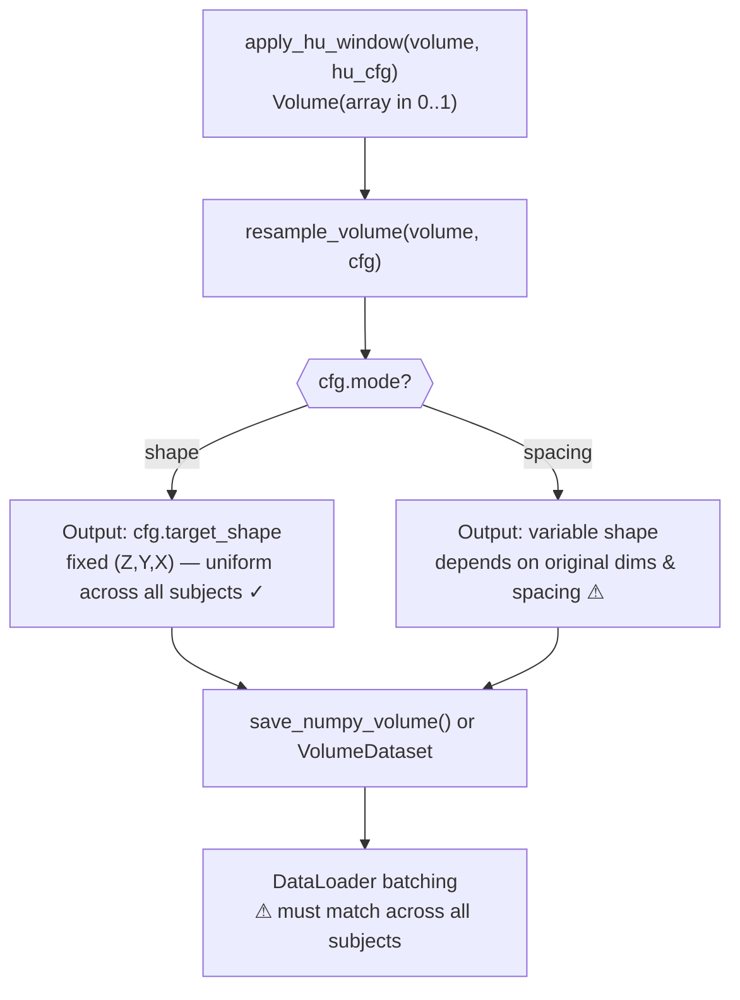

# `resample_volume()`

**Source:** `src/predict/preprocess.py`

Resamples a 3D [`Volume`](../io/Volume.md) to a target spatial resolution or fixed shape using `scipy.ndimage.zoom`.

---

## Signature

```python
def resample_volume(
    volume:   Volume,
    cfg:      ResampleConfig,
    is_label: bool = False,
) -> Volume
```

---

## Parameters

| Parameter | Type | Default | Description |
|---|---|---|---|
| `volume` | [`Volume`](../io/Volume.md) | — | Input volume with `array` shaped `(Z, Y, X)` |
| `cfg` | [`ResampleConfig`](../config/ResampleConfig.md) | — | Resampling configuration (mode, target shape/spacing, interpolator) |
| `is_label` | `bool` | `False` | If `True`, forces nearest-neighbour interpolation to avoid fractional label values |

---

## Return Value

| Type | Description |
|---|---|
| [`Volume`](../io/Volume.md) | New `Volume` with resampled array; `spacing_zyx` is updated to reflect the new voxel spacing |

---

## Raises

| Exception | Condition |
|---|---|
| `ValueError` | `cfg.mode == "spacing"` but `volume.spacing_zyx` is `None` |
| `ImportError` | `scipy` is not installed |

---

## Resampling Modes

### `mode = "spacing"` (default)

Resamples the volume so that each voxel represents `cfg.target_spacing` mm in physical space.

The zoom factor for each axis is:

```
zoom_z = volume.spacing_zyx[0] / cfg.target_spacing[0]
zoom_y = volume.spacing_zyx[1] / cfg.target_spacing[1]
zoom_x = volume.spacing_zyx[2] / cfg.target_spacing[2]
```

Output shape varies by subject depending on the original volume dimensions and spacing.

### `mode = "shape"`

Resamples the volume to exactly `cfg.target_shape` voxels, regardless of physical spacing.

```
zoom_z = cfg.target_shape[0] / volume.array.shape[0]
zoom_y = cfg.target_shape[1] / volume.array.shape[1]
zoom_x = cfg.target_shape[2] / volume.array.shape[2]
```

Output shape is always `cfg.target_shape`.

---

## Interpolation

The scipy zoom `order` is determined by:

| Condition | Order | Method |
|---|---|---|
| `is_label=True` | 0 | Nearest-neighbour |
| `cfg.interpolator == "nearest"` | 0 | Nearest-neighbour |
| `cfg.interpolator == "linear"` | 1 | Trilinear |

> **Note:** `is_label=True` overrides `cfg.interpolator` unconditionally. Always use `is_label=True` when resampling segmentation masks.

---

## Spacing Update

After resampling, the `spacing_zyx` field of the returned `Volume` is updated:

- In `"spacing"` mode: set to `cfg.target_spacing`.
- In `"shape"` mode: updated to the physically-equivalent spacing of the new shape.
- If the input `spacing_zyx` was `None`, it remains `None` in the output.

---

## In the Data Pipeline

`resample_volume()` is called after HU windowing, producing the final preprocessed volume that is either saved to disk or fed directly into the dataset.



> **Shape-consistency note:** Use `mode="shape"` when generating `.npy` files for training to guarantee all saved arrays have the same `(Z, Y, X)` dimensions. With `mode="spacing"` (the default), each subject's output shape depends on its original scan dimensions and voxel spacing, so shapes vary — requiring [`pad_collate_fn()`](../dataset/pad_collate_fn.md) in the DataLoader or a separate normalization step.

### ASCII equivalent

```
apply_hu_window(volume, hu_cfg)
  └─► Volume(array[0..1])
        └─► resample_volume(volume, resample_cfg)   ← here
              └─► Volume(array, new shape/spacing)
                    ├─► save_numpy_volume()    (if export_processed=True)
                    └─► VolumeDataset.__getitem__()
```

---

## Usage Example

```python
from predict.config import ResampleConfig
from predict.preprocess import resample_volume
from predict.io import read_dicom_series
from pathlib import Path

volume = read_dicom_series(Path("data/raw/patient_001"))
print(volume.array.shape)    # e.g. (400, 512, 512)
print(volume.spacing_zyx)    # e.g. (0.625, 0.488, 0.488)

# Resample to 1 mm isotropic spacing
cfg = ResampleConfig(mode="spacing", target_spacing=(1.0, 1.0, 1.0))
resampled = resample_volume(volume, cfg)
print(resampled.array.shape)   # e.g. (250, 250, 250)
print(resampled.spacing_zyx)   # (1.0, 1.0, 1.0)

# Resample to fixed 128³ shape
cfg_shape = ResampleConfig(mode="shape", target_shape=(128, 128, 128))
resampled = resample_volume(volume, cfg_shape)
print(resampled.array.shape)   # (128, 128, 128)

# Resampling a segmentation mask
cfg = ResampleConfig(mode="spacing", target_spacing=(1.0, 1.0, 1.0))
mask_resampled = resample_volume(mask_volume, cfg, is_label=True)
```

---

## Notes

> **Warning:** `mode="spacing"` requires `volume.spacing_zyx` to be set. If the spacing is `None` (e.g., from a NumPy `.npy` file loaded with [`load_numpy_volume()`](../io/load_numpy_volume.md)), a `ValueError` is raised. Use `mode="shape"` for NumPy volumes without spacing metadata.

> **Warning:** Large zoom factors (e.g., upsampling from 0.5 mm to 1 mm) can significantly increase memory usage. Monitor RAM consumption on large datasets.

- `scipy.ndimage.zoom` is the only backend; there is no SimpleITK or ITK fallback.
- The function is **pure** — it does not modify the input `Volume`.

---

## Related

- [`ResampleConfig`](../config/ResampleConfig.md) — configuration dataclass
- [`apply_hu_window()`](apply_hu_window.md) — the preprocessing step that precedes resampling
- [`Volume`](../io/Volume.md) — the dataclass carrying the array and spacing
- [`run_pipeline()`](../pipeline/run_pipeline.md) — orchestrates preprocessing including this function
